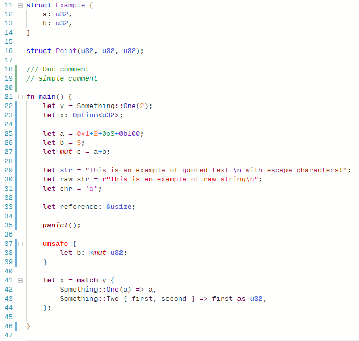
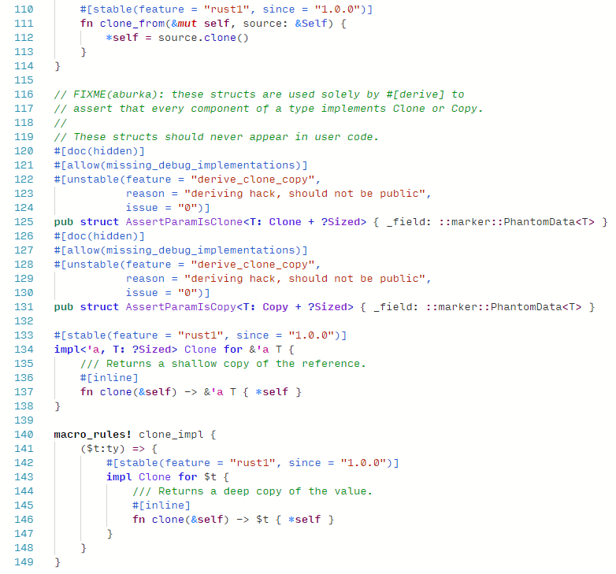

# Verdigris

Light rust-lang aware syntax coloring theme for VS Code and JetBrains IntelliJ/CLion/etc.

All rust-specific syntactic elements are colored differently - unsafe, mut, lifetimes, macros and so.
I'm not sure if it will look any good for any other language though.

Unfortunately VS Code and IntelliJ provide a different support for Rust syntax highlighting so there are some differencies in their coloring.  
I tried to make them as close as possible.

## Preview simple

## Preview complex

## TOML preview

## Release Note

### 0.0.2

- Added better TOML coloring support

### 0.0.1

- Initial release

## Links:

(here mostly for me not to search for them)

[VSCode Marketplace](https://marketplace.visualstudio.com/items?itemName=amomum.theme-verdigris-light)

